# Instalacja środowiska pracy

## 1. Pobierz instalator ze [strony producenta](https://dev.mysql.com/downloads/installer/)

## 2. Podążaj za instalatorem

  Wybieramy customową instalację:

  

  Potrzebny będzie nam serwer bazy danych:

  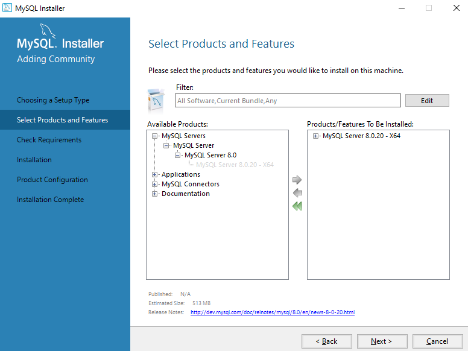

  Wygodnym narzędzie dostępu do bazy danych My SQL jest Workbench:

  

  Bardziej zaawansowani użytkownicy mogą preferować Command Line Interface:

  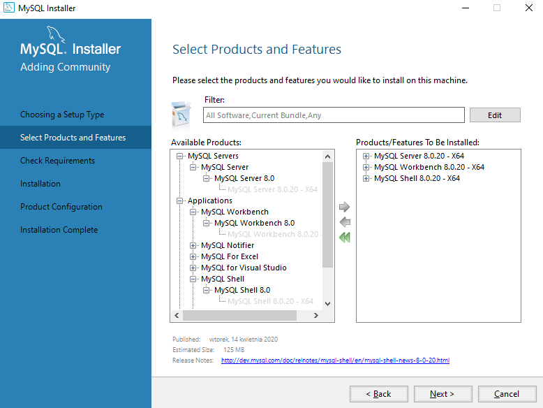

  Jeśli planujesz dłuższą przygodę z bazą danych My SQL miłym akcentem będzie dokumentacja i przykłady. Te elementy nie
  będą wymagane na tym kursie. Krok ten traktuj opcjonalnie:

  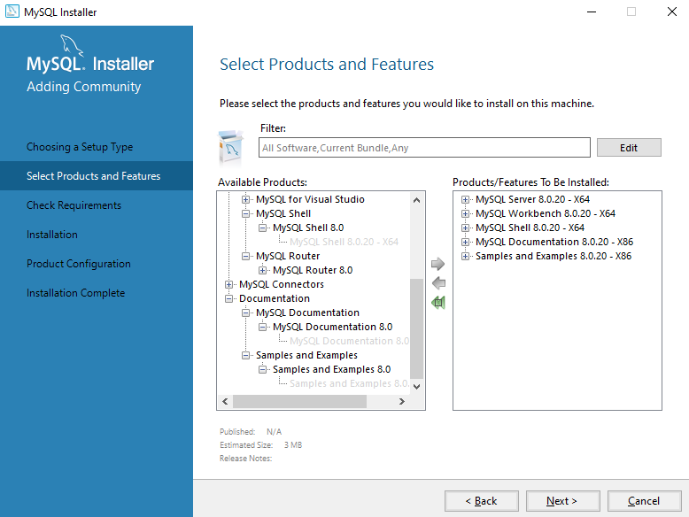

  Następne okno sprawdza czy na komputerze zainstalowano wcześniej programy używane przez elementy Twojej instalacji.
  W naszym przypadku na środowisku Windows potrzebny będzie: Microsoft Visual C++ 2019 Redistributable Package (x64)

  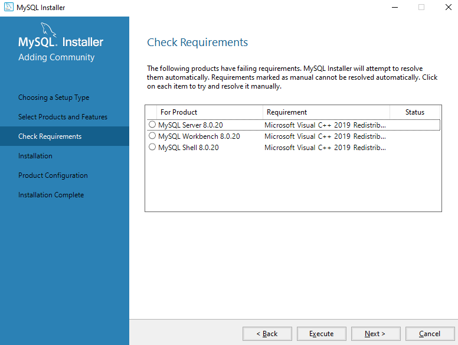

  Installer powinien automatycznie zainstalować wymagany pakiet:

  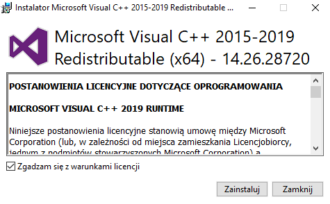

  Jeśli udało się zobaczysz następujące okno:

  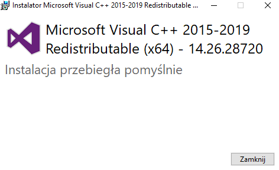

  Wracając do okna prerekwizytów widzimy:

  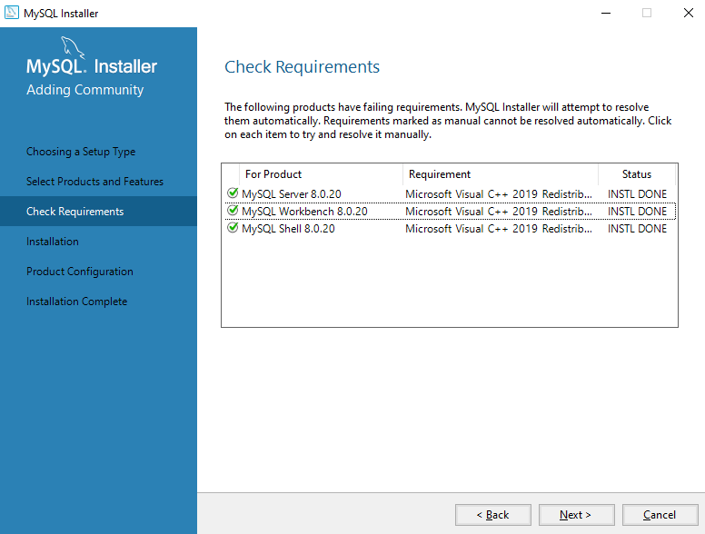

  Jeśli nie uda się zainstalować prerekwizyt Microsoft Visual C++ 2019 Redistributable Package (x64) możesz pobrać ten
  prerekwizyt ze [strony Microsoftu](https://visualstudio.microsoft.com/pl/downloads/)

  W kolejnych krokach widzimy progres instalacji:

  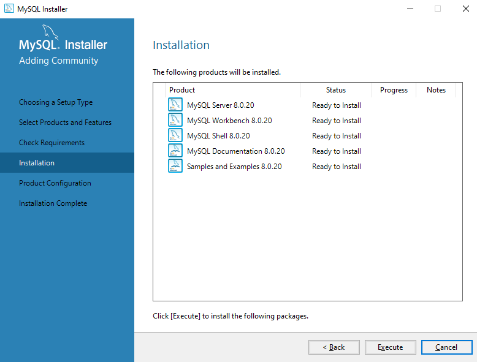
  

  Następnie produkt mus być skonfigurowany. Wybieramy domyślne ustawienia tak długo jak to możliwe:

  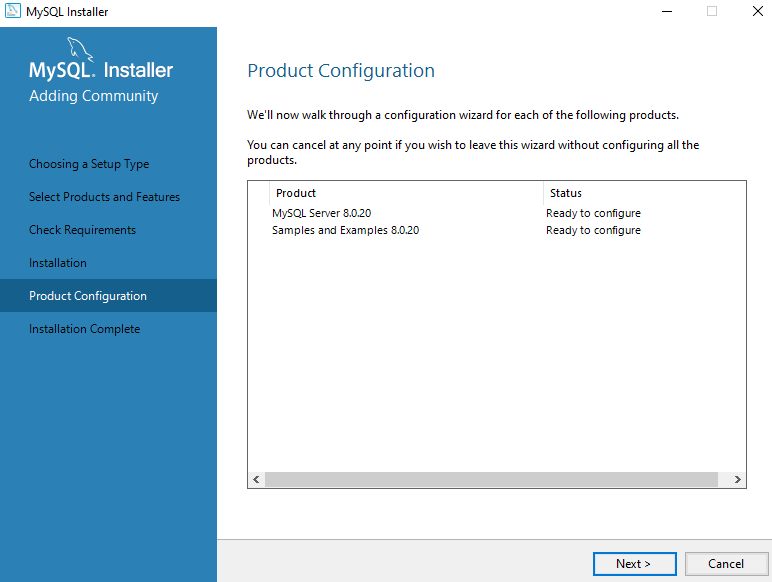
  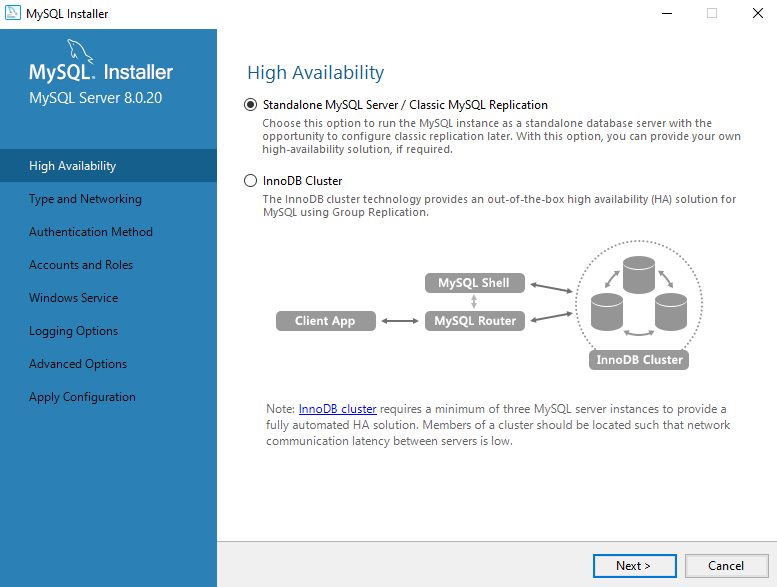
  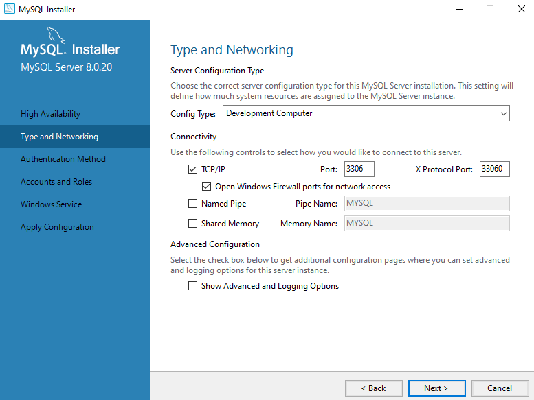
  

  Aby umożliwić połączenie do bazy danych potrzebujemy ustawić hasło konta głównego (tzw. root). Stwórz hasło bezpieczne
  ale i łatwe do zapamiętania:

  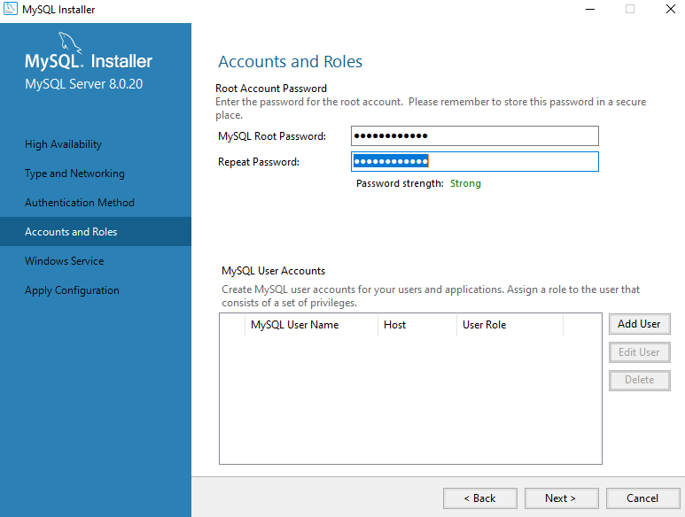

  Podążamy dalej używając domyślnych ustawień:

  
  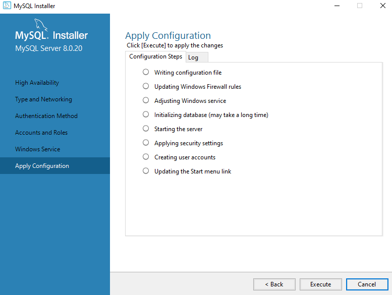
  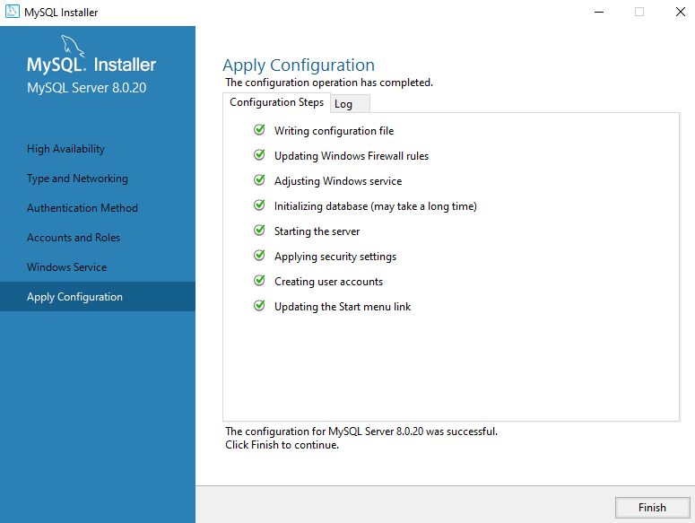
  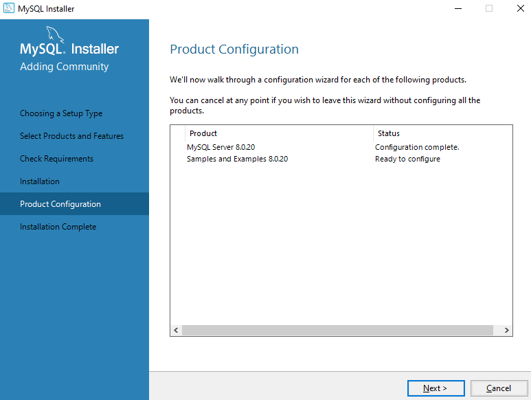

  Aby kontynuować instalację potrzebne będzie hasło konta głównego:

  
  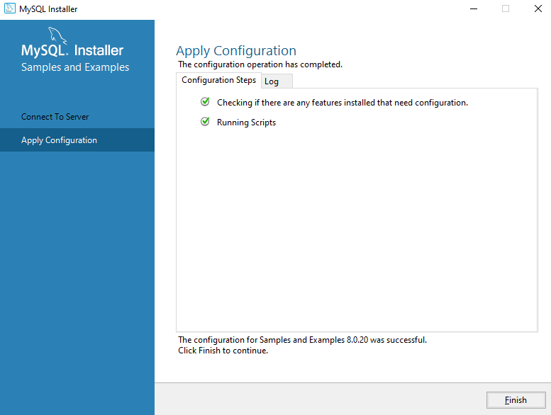
  
  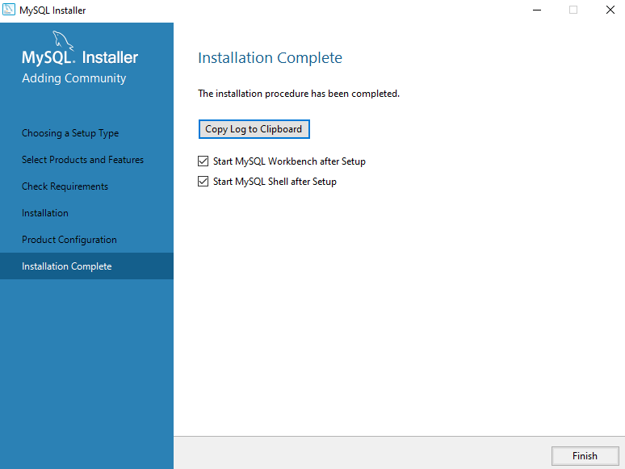

  Zależnie od preferencji możesz wybrać punkt 3.1 lub 3.2. W ramach z ajęć nie będzie miało znaczenia czy wolisz używać CLI
  czy narzędzia graficznego.

## 3.1. Uruchom CLI i użyj hasła które ustawione zostało w ramach instalacji.

  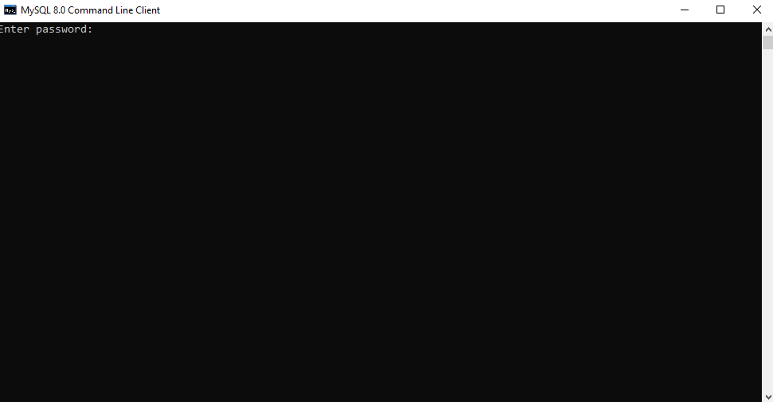
  

## 3.2. Uruchom Workbench i użyj hasła ustawionego w ramach instalacji

  
  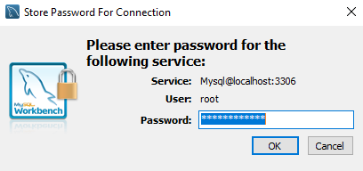
  

## 4. Stwórz bazę danych sda_test

  Materiał pomocniczy: [CREATE DATABASE](https://dev.mysql.com/doc/refman/8.0/en/creating-database.html)

## 5. Utwórz użytkownika z loginem odpowiadającym Twojemu imieniu

  Dokumentacja: [CREATE USER](https://dev.mysql.com/doc/refman/8.0/en/create-user.html)

## 6. Nadaj uprawnienia "do wszystkiego" utworzonemu użytkownikowi

  Materiały pomocnicze:
  [Dokumentacja GRANT](https://dev.mysql.com/doc/refman/8.0/en/grant.html)